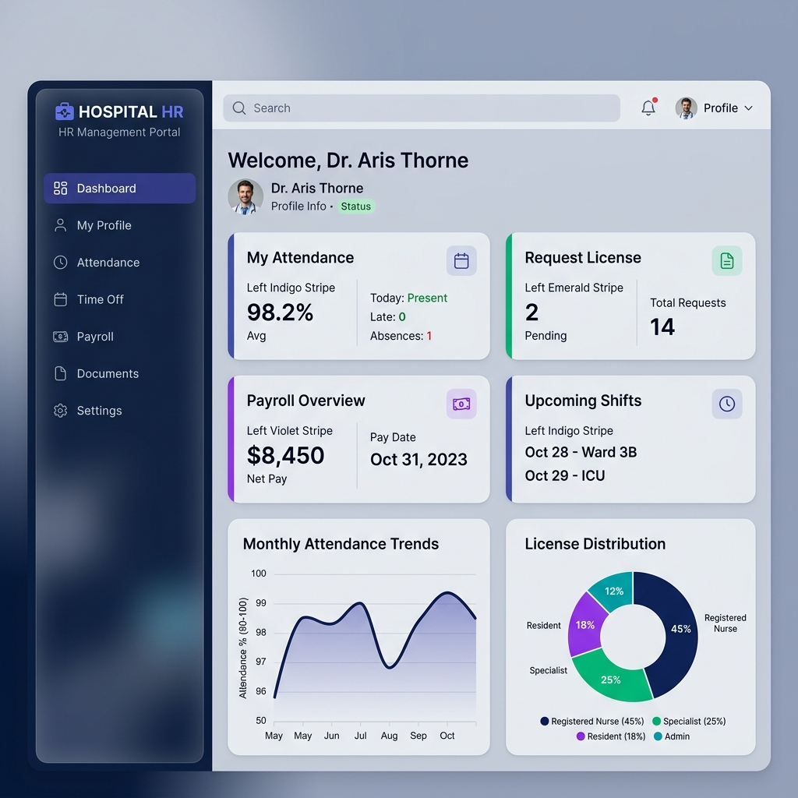
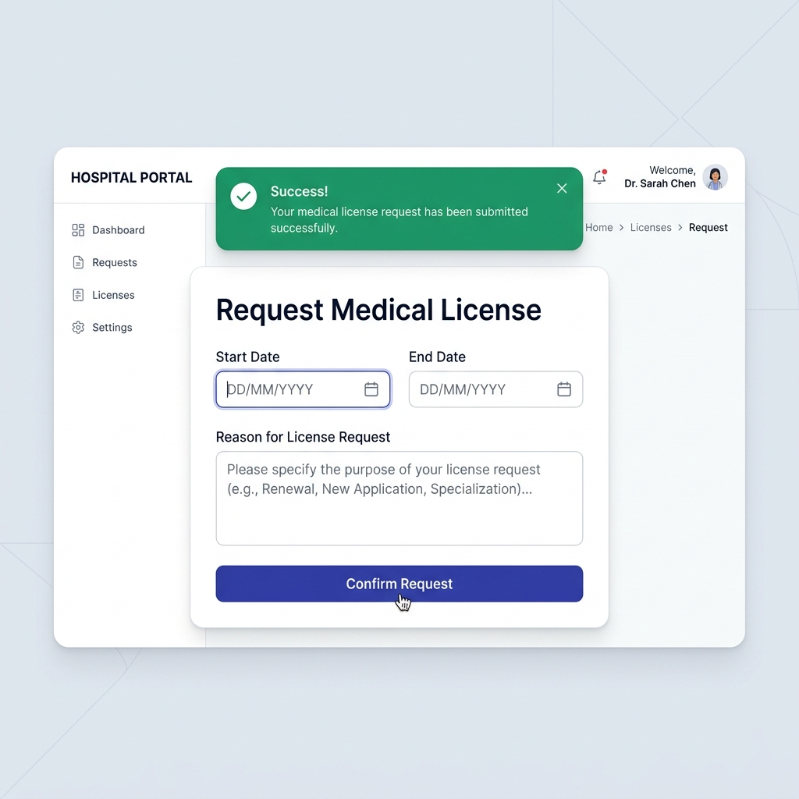
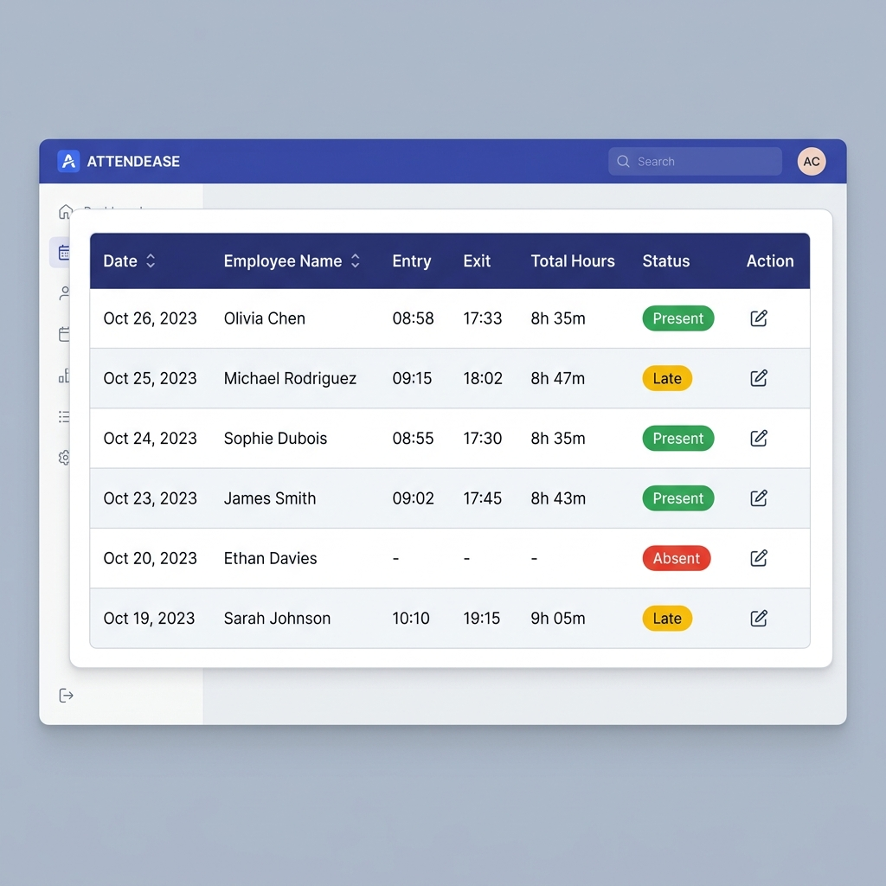

# Manual de Usuario: Portal de Autogestión Hospitalaria v2.0 🏥

¡Bienvenido al nuevo Portal de RRHH! Este manual te guiará a través de las funcionalidades del sistema, diseñado para que gestiones tu presentismo y licencias de forma rápida y sencilla.

---

## 1. Panel de Control (Dashboard)
Al ingresar, verás tu pantalla principal. Está diseñada con una **Grilla Bento** que te permite acceder a los servicios más importantes de un solo clic.

### Elementos clave:
- **Barra Lateral (Sidebar)**: Un menú moderno con efecto de vidrio que te permite navegar por todo el sitio.
- **Widgets de Estadísticas**: Números rápidos sobre tu estado actual, licencias activas y presentismo del día.
- **Gráficos de Inteligencia**: Si tenés rol de Jefe o RRHH, verás gráficos de tendencia de asistencia y distribución de licencias del mes.

---

## 2. Gestión de Licencias 📝
Solicitar un permiso o vacaciones nunca fue tan fácil. 

### Cómo solicitar una licencia:
1. Hacé clic en **"Solicitar Licencia"** desde el Dashboard.
2. Seleccioná el **Tipo de Licencia** (LAO, Médica, etc.).
3. Elegí las **Fechas de Inicio y Fin**.
4. ¡Listo! El sistema validará automáticamente que no tengas otra licencia en esas fechas y enviará el pedido a tu jefe.
5. Verás un **mensaje de éxito** en color verde cuando la solicitud se envíe correctamente.

---

## 3. Control de Asistencia (Mis Fichadas) ⏰
Podés consultar tus ingresos y egresos registrados en el reloj en tiempo real.

### Interpretando tus fichadas:
- **Estados**: El sistema te mostrará con "badges" de colores si tu fichada fue una Entrada (verde) o una Salida (azul).
- **Sincronización**: Los datos se bajan automáticamente del sistema de relojes central del hospital.
- **Historial**: Podés navegar por fechas anteriores para controlar que tus horas trabajadas sean las correctas.

---

## 4. Roles y Permisos 👤
Dependiendo de tu cargo, verás diferentes opciones:
- **Agente**: Acceso a sus propias fichadas y solicitud de licencias.
- **Jefe de Departamento**: Puede ver el presentismo de todo su equipo y aprobar/rechazar licencias.
- **Administrador / RRHH**: Control total de usuarios, roles y reportes analíticos globales.

---

> [!TIP]
> **SEGURIDAD**: El sistema de auditoría registra cada cambio importante. Asegurate de no compartir tu contraseña y cerrar sesión al finalizar, especialmente en computadoras compartidas de la guardia.

*Portal de Autogestión Hospitalaria - Desarrollado para la excelencia en la gestión pública.*
