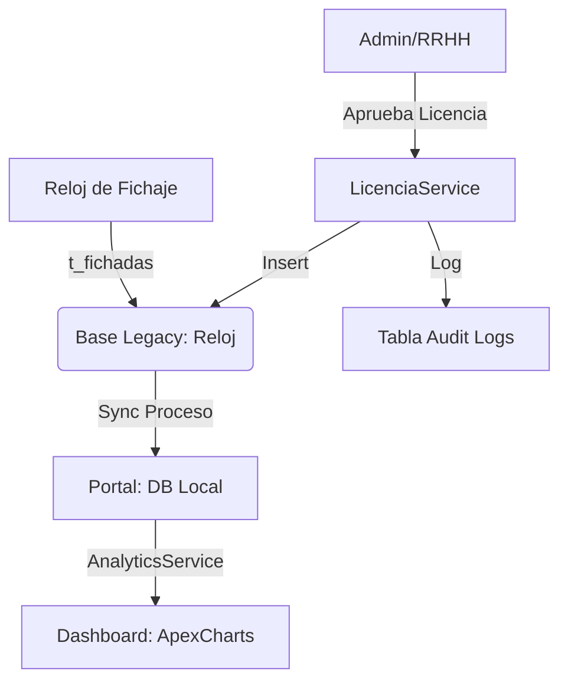

# Documentación Técnica: PortalHnoaRRHH v2.0 (Premium)

Esta documentación cubre la arquitectura, sistemas de seguridad y analíticas del portal después de la actualización de robustez y diseño de la Fase 6.

## 1. Arquitectura del Sistema
- **Backend**: Laravel 8.75 (PHP 7.4)
- **Frontend Interactivo**: Livewire 2.10 (TALL Stack parcial)
- **Estética**: Custom Design System basado en Bootstrap 5.3 + Glassmorphism.
- **Gráficos**: ApexCharts (vía CDN).

---

## 2. Persistencia y Bases de Datos 🗄️

El sistema utiliza un **Modelo Híbrido** de persistencia distribuido en dos conexiones principales (`config/database.php`):

### 2.1. Conexión `mysql` (Local)
Almacena los datos propios de la aplicación web:
- `t_agente_roles`: Pivot para el control de acceso.
- `t_solicitudes_licencias`: Gestión de pedidos pendientes/aprobados.
- `t_audit_logs`: Registro histórico de acciones administrativas (AuditTrail).
- `t_fichadas` (Sincronizadas): Caché local de las fichadas del reloj.

### 2.2. Conexión `reloj` (Legacy)
Conexión de solo lectura/escritura controlada al sistema **Factu30/Chronos** (IP: 10.12.4.2):
- `t_agente`: Maestro de empleados.
- `t_fichadas`: Registro original de hardware.
- `t_inasist`: Tabla donde el portal inyecta licencias aprobadas.

---

## 3. Seguridad y Control de Acceso (RBAC) 🛡️

### 3.1. Roles Definidos
El sistema utiliza el método `hasRole()` en el modelo `Agente` para validar permisos:
- `ADMIN`: Acceso total.
- `RRHH`: Gestión de personal y licencias.
- `JEFE`: Visualización de fichadas de equipo y aprobación de licencias.
- `GESTOR_NOVEDADES`: Acceso exclusivo al módulo de noticias.

### 3.2. Auditoría (Caja Negra)
Se implementó el `AuditService` que registra automáticamente:
- **Evento**: Qué acción se realizó (ej: `APROBAR_LICENCIA`).
- **Autor**: Quién lo hizo (`user_id`).
- **Metadata**: IP de origen y Navegador (`User-Agent`).
- **Payload**: Detalles técnicos en formato JSON de qué se modificó.

---

## 4. Flujo de Datos 🔄

---

## 5. Troubleshooting: Resolución de Errores Comunes 🛠️

### 5.1. "SQLSTATE[HY000] [2002] Connection refused" (Base Reloj)
- **Causa**: El servidor legado no permite la conexión desde la IP del portal.
- **Solución**: Verificar que la IP del servidor de producción esté en la lista blanca (whitelist) del servidor 10.12.4.2. Usar `telnet 10.12.4.2 3306` para probar conectividad.

### 5.2. "419 Page Expired"
- **Causa**: Token CSRF inválido o sesión expirada.
- **Solución**: Limpiar cookies del navegador o aumentar `SESSION_LIFETIME` en el `.env`.

### 5.3. "MassAssignmentException"
- **Causa**: Intento de grabar un campo no permitido en `$fillable`.
- **Solución**: Revisar el modelo correspondiente. Por seguridad, `age_password_hash` está bloqueado para asignación masiva.

### 5.4. Gráficos no aparecen en el Dashboard
- **Causa**: Caché de vistas vieja o falta de conexión a Internet (CDN de ApexCharts).
- **Solución**: Ejecutar `php artisan view:clear` y verificar salida de consola (F12) por errores de carga de scripts.

---

## 6. Mantenimiento Preventivo
1. **Logs del Sistema**: Revisar periódicamente `storage/logs/laravel.log`.
2. **Backups**: Realizar backup diario de la base `mysql` local (donde viven los roles y las solicitudes de licencias nuevas).
3. **Limpieza de Auditoría**: La tabla `t_audit_logs` puede crecer mucho. Se recomienda un proceso de purga anual para registros de más de 2 años.

---

*Documentación generada por Antigravity AI - Seguridad Social & RRHH.*
